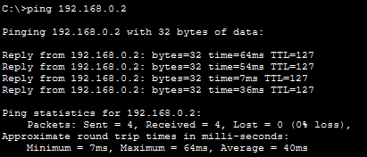
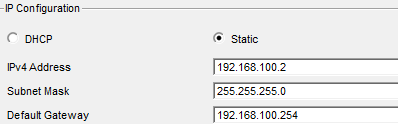
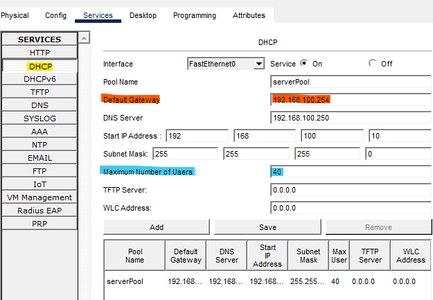
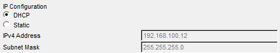
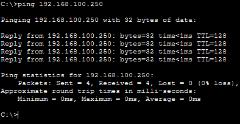
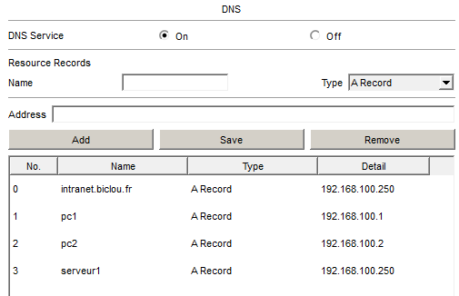
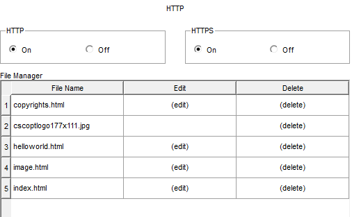
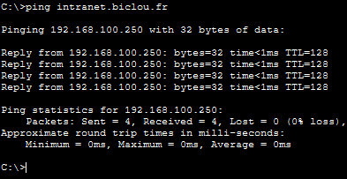
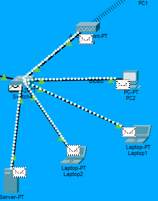

# Procédure Technique – Infrastructure Réseau Cisco

## Sommaire

1. [Topologie du réseau](#1-topologie-du-réseau)
2. [Mission 1 – Connexion au serveur de fichiers](#2-mission-1--connexion-au-serveur-de-fichiers)
3. [Mission 2 – Interconnexion inter-sites + ports Gigabit](#3-mission-2--interconnexion-inter-sites--ports-gigabit)
4. [Mission 3 – Serveur DHCP pour commerciaux itinérants](#4-mission-3--serveur-dhcp-pour-commerciaux-itinérants)
5. [Mission 4 – Serveur DNS + site intranet](#5-mission-4--serveur-dns--site-intranet)
6. [Difficultés rencontrées et solutions](#6-difficultés-rencontrées-et-solutions)

---

## 1. Topologie du réseau

Ce projet simule l'interconnexion de deux entreprises via un cœur de réseau :

| Zone | Contenu |
|---|---|
| **Site A** | Réseau local avec PC filaires, laptops Wi-Fi, serveur de fichiers |
| **Site B** | Plusieurs postes de travail, laptops, serveur DHCP/DNS/HTTP |
| **Cœur réseau** | Routeur Cisco 2911 reliant les deux sites |


---

## 2. Mission 1 – Connexion au serveur de fichiers

### Objectif
Configurer le réseau local du Site A et connecter les postes au serveur de fichiers.

### Réalisations

**Connexion du premier PC au serveur**

Câblage de PC0 vers le serveur via câble droit.


**Configuration IP statique sur PC0**

| Paramètre | Valeur |
|---|---|
| Adresse IP | `192.168.0.1` |
| Masque | `255.255.255.0` |
| Passerelle | `192.168.0.254` |

**Test de connectivité**
```
ping 192.168.0.1  →  réussi ✅
```

**Problème rencontré — ports switch saturés**

Message Packet Tracer : `No available port` → plus de ports libres sur le switch existant.


**Solution appliquée**

Ajout d'un switch supplémentaire, branchement de PC0, Laptop1 et Server0 dessus, puis configuration IP statique du deuxième PC (`192.168.0.2 /24`).

```
ping PC ↔ serveur  →  réussi ✅
ping PC ↔ PC       →  réussi ✅
```



---

## 3. Mission 2 – Interconnexion inter-sites + ports Gigabit

### Objectif
Permettre le partage de données entre les deux sites via le cœur réseau.

### Plan d'adressage

| Site A | IP | Site B | IP |
|---|---|---|---|
| Server0 | `192.168.0.1` | PC1 | `192.168.100.1` |
| PC0 | `192.168.0.2` | PC2 | `192.168.100.2` |
| Laptop1 | `192.168.0.3` | — | — |
| Passerelle | `192.168.0.254` | Passerelle | `192.168.100.254` |

### Réalisations

- Création du réseau local Site B (PC1, PC2, switch)
- Configuration IP statique des postes avec passerelle `192.168.100.254`
- Activation des ports Gigabit sur les switches




---

## 4. Mission 3 – Serveur DHCP pour commerciaux itinérants

### Objectif
Déployer un serveur DHCP sur le Site B pour attribuer automatiquement des adresses IP aux laptops des commerciaux.

### Configuration du pool DHCP

| Paramètre | Valeur |
|---|---|
| Nom du pool | `serverPool` |
| Réseau | `192.168.100.0 /24` |
| IP du serveur | `192.168.100.250` |
| Plage d'adresses | `192.168.100.10` → `192.168.100.50` |
| Nombre max d'utilisateurs | `40` |
| Passerelle | `192.168.100.254` |



### Réalisations

- Ajout de deux laptops et d'un serveur (Server1) sur le Site B
- Activation du service DHCP sur Server1
- Les PC fixes conservent leur IP statique
- Les laptops configurés en DHCP obtiennent automatiquement une IP dans la plage définie



**Test de connectivité**
```
ping Laptop → 192.168.100.250  →  réussi ✅
```



---

## 5. Mission 4 – Serveur DNS + site intranet

### Objectif
Mettre en place un serveur DNS et héberger un portail intranet accessible par nom de domaine.

### Enregistrements DNS configurés

| Nom | Type | IP |
|---|---|---|
| `intranet.siteB.fr` | A Record | `192.168.100.250` |
| `pc1` | A Record | `192.168.100.1` |
| `pc2` | A Record | `192.168.100.2` |
| `serveur1` | A Record | `192.168.100.250` |

### Réalisations

- Activation du service DNS sur Server1
- Ajout des enregistrements de type A
- Activation du service HTTP pour héberger la page intranet
- Développement de la page `index.html` du portail intranet




**Configuration DNS sur les postes fixes**

Renseignement du serveur DNS `192.168.100.250` directement dans la config IP de PC1 et PC2.

**Mise à jour du pool DHCP**

Ajout du serveur DNS `192.168.100.250` dans le pool `serverPool` → les laptops obtiennent désormais le DNS automatiquement via DHCP.

**Tests de validation**
```
ping intranet.siteB.fr   →  résolution correcte ✅  (192.168.100.250)
http://intranet.siteB.fr →  page web affichée ✅
```





---

## 6. Difficultés rencontrées et solutions

| Difficulté | Solution appliquée |
|---|---|
| Ports switch saturés (`No available port`) | Ajout d'un switch supplémentaire |
| DNS absent du pool DHCP → laptops ne résolvent pas les noms | Ajout du serveur DNS dans la configuration du pool DHCP |
| Vérification du routage inter-sites | Méthodologie ping étape par étape : local → passerelle → inter-site |
