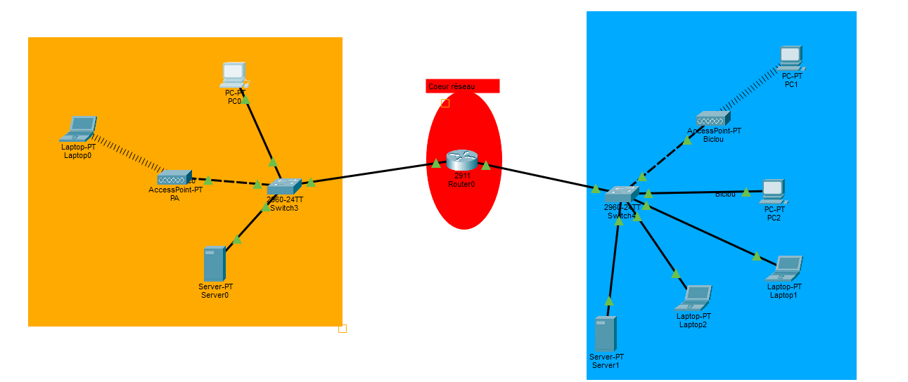
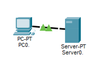

# Procédure Technique – Infrastructure Réseau Cisco

## Sommaire

1. [Topologie du réseau](#1-topologie-du-réseau)
2. [Mission 1 – Connexion au serveur de fichiers](#2-mission-1--connexion-au-serveur-de-fichiers)
3. [Mission 2 – Interconnexion inter-sites + ports Gigabit](#3-mission-2--interconnexion-inter-sites--ports-gigabit)
4. [Mission 3 – Serveur DHCP pour commerciaux itinérants](#4-mission-3--serveur-dhcp-pour-commerciaux-itinérants)
5. [Mission 4 – Serveur DNS + site intranet](#5-mission-4--serveur-dns--site-intranet)
6. [Difficultés rencontrées et solutions](#6-difficultés-rencontrées-et-solutions)

---

## 1. Topologie du réseau

Ce projet simule l'interconnexion de deux entreprises via un cœur de réseau :

| Zone | Contenu |
|---|---|
| **Site A** | Réseau local avec PC filaires, laptops Wi-Fi, serveur de fichiers |
| **Site B** | Plusieurs postes de travail, laptops, serveur DHCP/DNS/HTTP |
| **Cœur réseau** | Routeur Cisco 2911 reliant les deux sites |

---

## 2. Mission 1 – Connexion au serveur de fichiers

### Objectif
Configurer le réseau local du Site A et connecter les postes au serveur de fichiers.

### Réalisations

**Connexion du premier PC au serveur**

Câblage de PC0 vers le serveur via câble droit.

**Configuration IP statique sur PC0**

| Paramètre | Valeur |
|---|---|
| Adresse IP | `192.168.0.1` |
| Masque | `255.255.255.0` |
| Passerelle | `192.168.0.254` |

**Test de connectivité**
