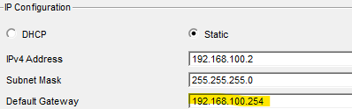

# TP-Infrastructure-R-seau-Services-Intranet
Ce dépôt contient l'étude et la mise en œuvre d'une infrastructure réseau complète d'une entreprise. L'objectif principal est de simuler une interconnexion d'entreprise avec gestion de services critiques et partage de ressources.

# 🚲 Projet : Infrastructure Réseau & Services Intranet - Biclou

## 📝 Introduction
Ce projet, réalisé avec **Cisco Packet Tracer**, simule l'interconnexion réseau entre deux entreprises : **Taco** (zone orange) et **Biclou** (zone bleue). L'objectif est de déployer une infrastructure complète incluant le routage via un cœur de réseau (Cisco 2911), l'adressage dynamique, la résolution de noms et l'hébergement web.

 
---

## 📌 Sommaire
1. [Mission 1 : Connexion initiale et limites matérielles](#mission-1)
2. [Mission 2 : Partage des locaux et Adressage Statique](#mission-2)
3. [Mission 3 : Mobilité et Automatisation (DHCP)](#mission-3)
4. [Mission 4 : Services DNS et Hébergement Web](#mission-4)
5. [Validation et Analyse Simulation](#validation)
6. [Conclusion et Compétences](#conclusion)

---

## 1. 🛠 Mission 1 : Connexion initiale et limites matérielles
L'étape initiale consistait à relier un ordinateur au serveur de fichiers de Taco. 

* **Problématique :** Une erreur est apparue lors de l'ajout d'un second PC car le serveur ne possédait qu'une seule interface réseau.
 
* **Solution :** Ajout d'un switch supplémentaire pour étendre la capacité de connexion du réseau.

---

## 2. 🏢 Mission 2 : Partage des locaux et Adressage Statique
Cette mission visait à interconnecter Biclou et Taco pour permettre le partage de données.

* **Configuration Biclou :** Attribution d'adresses IP statiques pour les postes fixes (PC1, PC2, Serveur 1).
* **Optimisation :** Activation des ports **Gigabit** sur les interfaces du routeur pour assurer un débit performant entre les deux sites.
* **Routage :** Configuration des passerelles par défaut pour permettre la communication inter-réseaux.

 

---

## 3. 📱 Mission 3 : Mobilité et Automatisation (DHCP)
Mise en place d'un accès réseau pour deux commerciaux itinérants équipés d'ordinateurs portables.

* **Service DHCP :** Configuré sur le **Serveur 1** de Biclou.
* **Plage d'adresses :** Configuration du pool de `192.168.100.10` à `192.168.100.50`.
* **Validation :** Test de connectivité (Ping) réussi depuis les laptops vers le serveur de Taco.

.

---

## 4. 🌐 Mission 4 : Services DNS et Hébergement Web
Déploiement d'un site intranet pour répertorier les pièces détachées de Biclou.

**Annuaire DNS :** Liaison du nom de domaine `intranet.biclou.fr` à l'adresse IP du Serveur 1 (`192.168.100.250`).

**Serveur Web :** Activation du service HTTP et développement de la page d'accueil personnalisée "BICLOU : ESPACE SALARIÉS".

---

## 🔍 Validation et Analyse Simulation

### Analyse des protocoles
Le mode simulation a permis d'observer la chronologie réelle des échanges:
1. **Requête DNS :** Traduction du nom de domaine en adresse IP.
2. **Protocole ICMP :** Vérification de la connectivité via le Ping.
3. **Protocole HTTP :** Accès final au site via le navigateur web.

---

## 🎓 Conclusion et Compétences
Ce projet a permis de valider des compétences clés en administration réseau:
* Maîtrise de l'adressage IP (Statique et DHCP).
* Configuration de services applicatifs (DNS, HTTP).
* Diagnostic réseau via les outils de simulation et de test (Ping).

---
**Réalisé par :** Clara (SIO 27) 
**Logiciel :** Cisco Packet Tracer
